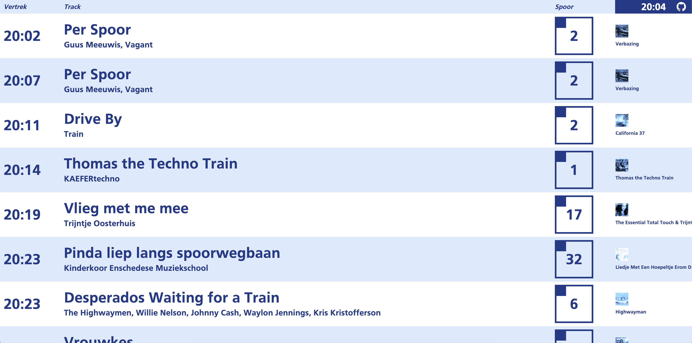

# Tracklist

Visualiseer je Spotify wachtrij met een Hollands tintje



Tracklist doet het heel goed op feestjes.

> "Een hip fenomeen en een beetje het hebbedingetje van deze tijd"
> ~ H. Heutink[^1]

[^1]: https://nos.nl/artikel/2506228-kamermeerderheid-wil-onderzoek-naar-gepersonaliseerde-kentekens

## Ontwikkelen

Tjap de dependencies met `npm install`, en run die zooi lokaal:

```bash
npm run dev
```

Een kind kan de wasm doen

## Dankbetuigingen
Dan wil ik nog een paar mensen bedanken, want je doet het nooit _echt_ alleen:

- Wouter Koolmees voor het inspireren van het ontwerp.
- Spotify voor het eerste bedrijf zijn dat zowaar een degelijke API weet neer te zetten.
- Deze [shady website](https://en.likefont.com/font/12729376/) voor het lettertype.

Zonder jullie was dit project niet gelukt.
